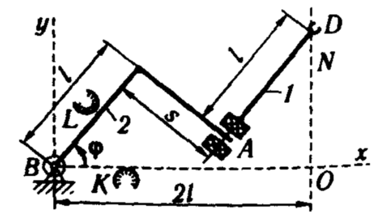
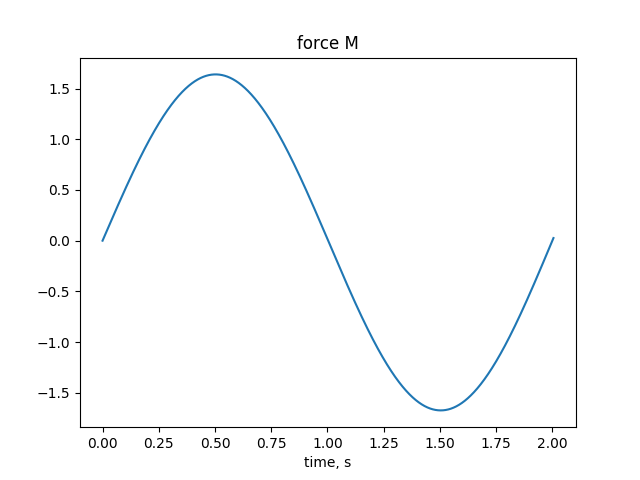
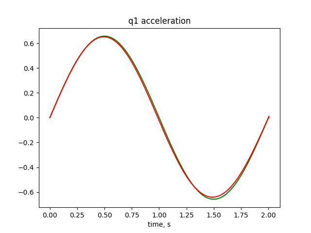

# RobotForceControl

Applying 2nd order Lagrange Equations to find
forces and torgues providing controllable robot motions
with predefined trajectory.

This python script finds moment of 1st revolute joint
and force of 2nd prismatic joint for a given robot model. 
Trajectory is linear from point O to point D along ***y*** axis.

It uses dynamic equation written in matrix form to solve inverse dynamics
and then simulate motion with direct dynamics.

 
 
 It still has some ploblems with formulas (desired and real plots are not identical)
 
 Script draws different plots. For example, 1st joint force (as function of time) and acceleration (desired green and simulated red).
 
 
 
